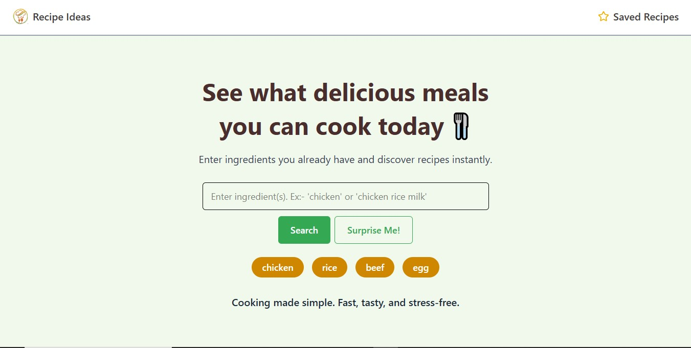
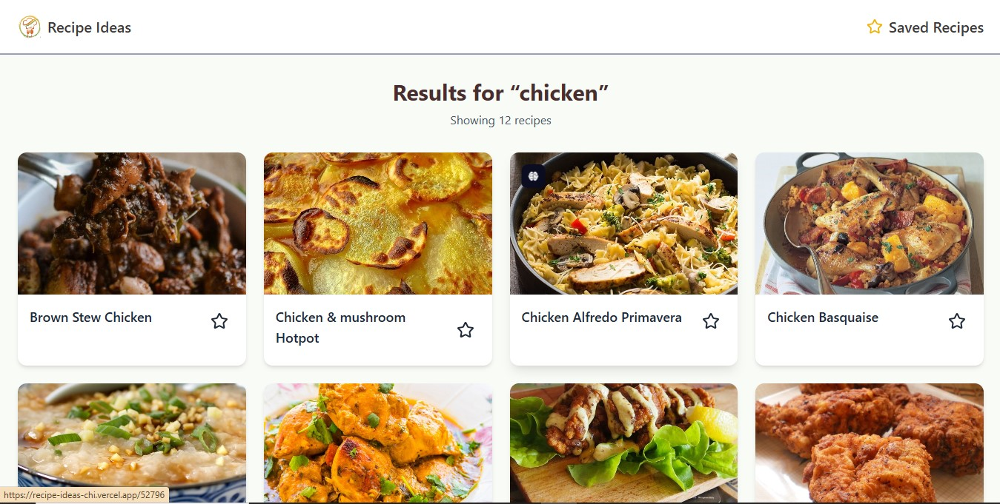
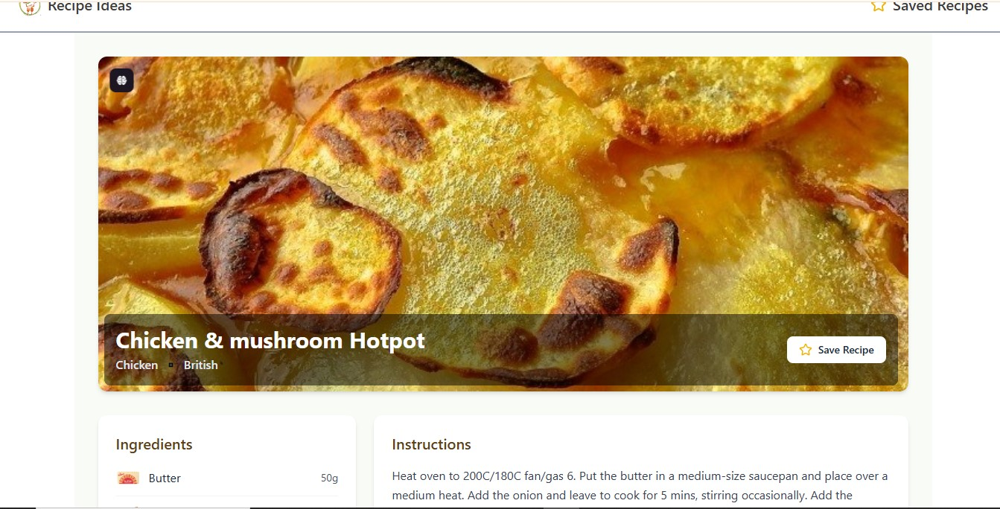
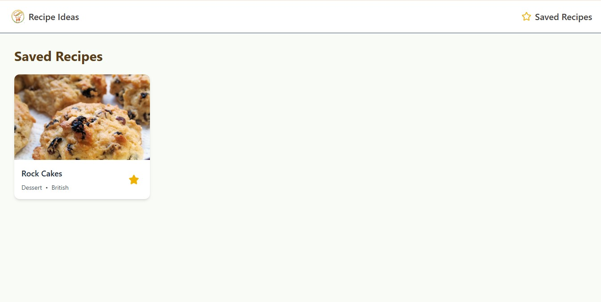

# 🍲 Recipe Ideas App

A simple and interactive web application that helps users discover recipes based on ingredients.  
Built with **React**, **Vite**, and **Tailwind CSS**, the app uses the [TheMealDB API](https://www.themealdb.com/api.php) to fetch recipes and display details such as ingredients, cooking instructions, and video tutorials.

---

## ✨ Features

- 🔎 **Search Recipes** by one or more ingredients
- 📖 **View Recipe Details** including:
  - Ingredients with images and measures
  - Step-by-step cooking instructions
  - YouTube video tutorials
- 🎲 **Random Recipe Generator** for quick inspiration
- ⭐ **Save Recipes** locally to view later (using `localStorage`)
- 🖼️ **Ingredient Images** displayed alongside their measures
- 📱 Fully **responsive UI** with clean design (desktop + mobile)
- ⚠️ Graceful **error handling** (no results / API error)

---

## 🛠️ Tech Stack

- **React + Vite** → Fast and modern frontend setup
- **Tailwind CSS** → Styling and responsive design
- **Axios** → API calls
- **LocalStorage** → Save and persist user’s favorite recipes
- **TheMealDB API** → Open recipe database

---

## 🚀 Getting Started

### 1. Clone the repository

```bash
git clone https://github.com/sheikh-aleem72/Recipe-Ideas.git
cd recipe-ideas-app
```

### 2. Install dependencies

```bash
npm install
```

### 3. Environment Variables

Create a `.env` file in the root and add:

```env
VITE_API_URL=https://www.themealdb.com/api/json/v1/1
```

### 4. Run the project

```bash
npm run dev
```

The app will be available at `https://recipe-ideas-chi.vercel.app/`.

---

## 🌍 Deployment

You can deploy the app for free on:

- [Vercel](https://vercel.com/)
- [Netlify](https://www.netlify.com/)
- [CodeSandbox](https://codesandbox.io/)

---

## 📸 Screenshots

### 🏠 Home page

Home page with welcome message and searching elements


### 🔎 Search Results

Displays recipes found for a given ingredient.


### 📖 Recipe Details

Shows ingredients with images, measures, instructions, and video.


### ⭐ Saved Recipes

Allows users to save and view favorite recipes.


---

## 🔮 Future Improvements

- 📂 **Filter recipes by category or area** (e.g., Italian, Mexican, Dessert)
- 🌍 **Show cuisine flags** for areas (via external flag API)
- 🧾 **Advanced search** with multiple ingredients (AND logic)
- 📝 **User notes** for each saved recipe
- 🌙 **Dark mode** support

---

## 🧑‍💻 Author

Developed by **Shekh Aalim**
Built with ❤️ using React, Vite, and Tailwind CSS.

---
